<!-- synthwave profile README — keix40 -->


<h2 align="center">Full-Stack Developer · Software Engineer</h2>

<p align="center">
  
</p>

<p align="center">
  
</p>

---

## 👨‍💻 About Me

Hello! I'm a passionate **Senior Software Engineer** at **ACE Data Systems** driven by building scalable systems, exploring cybersecurity, and crafting seamless developer workflows.

- 🔭 **Currently Building:** Enterprise multi-tenant web applications, real-time collaboration engines, and developer automation tools.
- 🌱 **Currently Learning:** Advanced German (Deutsch), Linux Terminal Security & Command-line challenges (OverTheWire Bandit), and 3D Modeling with Blender.
- 💬 **Ask Me About:** C#, ASP.NET Core, Java, Spring Boot, Angular, SQL Databases, Git Workflows, and Linux CLI.
- ⚡ **Fun Fact / Outside Code:** When I'm not writing code or solving security challenges, you’ll find me playing the guitar, sketching 3D models in Blender, or playing video games like League of Legends, TFT, and PUBG.

---

### 📊 Snapshot

| Category | Focus Area |
| :--- | :--- |
| **Now** | ASP.NET Core, Spring Boot, Angular, SQL, Cloud Deployment (Vercel, Render) |
| **Learning** | German Language, Cybersecurity / Linux Fundamentals, Blender 3D |
| **Interests** | Backend Architecture, Web Security, Developer Tools, Guitar |
| **Availability** | Open to Senior Software Engineering roles, including Remote & International opportunities |

```typescript
const kei = {
  role: "Senior Software Engineer at ACE Data Systems",
  learning: [
    "German (Deutsch)",
    "Linux security — OverTheWire Bandit",
    "Blender 3D modeling",
  ],
  interests: [
    "Backend architecture",
    "Web security",
    "Developer tools",
    "Guitar",
  ],
  openTo: [
    "Senior software engineering roles",
    "Remote opportunities",
    "International opportunities",
  ],
};
```

---

## 🛠️ Tech Stack

<p align="center"><b>Languages</b></p>
<p align="center">
  
</p>

<p align="center"><b>Frameworks & libraries</b></p>
<p align="center">
  
</p>

<p align="center"><b>Data, tooling & cloud</b></p>
<p align="center">
  
</p>

<p align="center"><b>Deploy & 3D</b></p>
<p align="center">
  
</p>

<p align="center">
  
  
  
  
</p>

---

## 📊 GitHub Stats

<p align="center">
  
  
</p>

<p align="center">
  
</p>

---

## 🚀 Featured Projects

| Project | Highlights | Links |
| :--- | :--- | :--- |
| **Britium Gallery** | E-commerce with **Spring Boot 3**, **JWT** auth, **Angular 19**, admin portal, reporting, deploy on **Render** + **Vercel**, **MySQL** (e.g. Aiven) | [Repo](https://github.com/keix40/OjtFinalProject) · [Live](https://ojt-final-project.vercel.app/) |
| **3dprofolio** | **React 19**, **Three.js**, React Three Fiber, Drei, **GSAP**, Framer Motion, **Tailwind** | [Repo](https://github.com/keix40/3dprofolio) · [Live](https://3dprofolio.vercel.app/) |
| **receipt-split** | **Next.js 16**, vision **OCR** (AI SDK), cent-exact bill split, **Postgres** + Drizzle, **Vercel** | [Repo](https://github.com/keix40/receipt-split) · [Live](https://receipt-split-gamma-sable.vercel.app/) |
| **liveboard** | **Yjs** CRDT, WebSockets, offline-first whiteboard, **Next.js** + Node sync on **Render** | [Repo](https://github.com/keix40/liveboard) · [Live](https://liveboard-lyart.vercel.app/) |
| **AuditTrail** | Automated code review & security scanner API: **FastAPI**, sandboxed **Semgrep** / **Bandit** / **Gitleaks** scans, GitHub App PR reviews, **Postgres**, API on **Render** | [Repo](https://github.com/keix40/audittrail) · [Live API](https://audittrail-api-mo9q.onrender.com/docs) |
| **LogPulse** | Real-time log viewer & alert bot: **Go** ingest + alert engine, **Redis Streams**, **Postgres**, live **Next.js** dashboard, Slack / Discord / Telegram alerts, **Render** + **Vercel** | [Repo](https://github.com/keix40/logpulse) · [Live](https://logpulse-web-seven.vercel.app/) · [API](https://logpulse-api-pb1p.onrender.com/healthz) |
| **OmniFleet** | Multi-tenant fleet & logistics tracking: **Go** **gRPC** microservices, **Postgres RLS**, **NATS JetStream**, WebSocket live tracking, **Kubernetes** / **Terraform** / **Helm**, **Render** + **Vercel** | [Repo](https://github.com/keix40/omnifleet) · [Live](https://omnifleet-dashboard.vercel.app/) · [API](https://omnifleet-api.onrender.com/healthz) |
| **MM-NameChanger** | Romanized Myanmar names → Myanmar **Unicode** script: dictionary + syllable rule engine (no AI), JSON API, CSV batch mode, **Next.js 15**, **TypeScript**, **Vercel** | [Repo](https://github.com/keix40/mm-namechanger) · [Live](https://mm-namechanger.vercel.app/) |

<!-- PROJECT_ROW: duplicate a table row above when you ship something new -->

---

## ⏱️ Recent Activity

<!--
  This section is filled in automatically by the anmol098/waka-readme-stats GitHub Action.
  It needs a WakaTime account and a WAKATIME_API_KEY repository secret in keix40/keix40
  (plus a GH_TOKEN secret, per the action's docs). Do not edit between the markers by hand.
-->
<!--START_SECTION:waka-->
<!--END_SECTION:waka-->

---

## 📫 Contact

<p align="center">
  <a href="mailto:htooaungyeyint65@gmail.com">
    
  </a>
  <a href="https://www.linkedin.com/in/htoo-aung-ye-yint-950417285">
    
  </a>
  <a href="https://3dprofolio.vercel.app/">
    
  </a>
  <a href="https://github.com/keix40">
    
  </a>
</p>

<p align="center">
  Open to Senior Software Engineering roles, including Remote &amp; International opportunities
</p>


